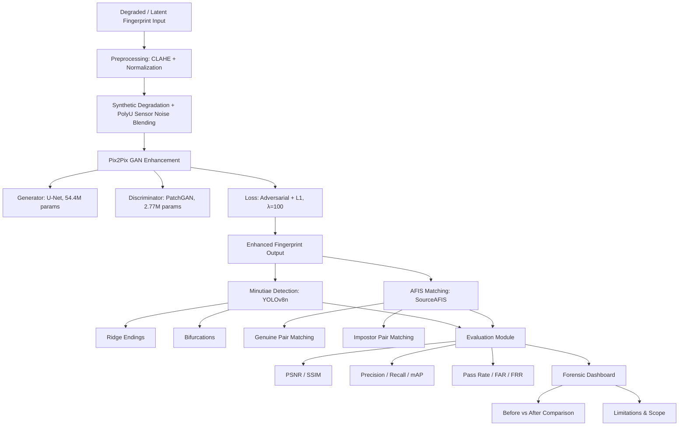

# GAFIS
# GAN-based Automated Fingerprint Identification System

AI-Assisted Forensic Enhancement & Minutiae Localization in Partial Latent Fingerprints

**GAFIS** is a research prototype exploring how a Pix2Pix Conditional GAN, combined with automated minutiae localization (YOLOv8) and AFIS matching evaluation (SourceAFIS), can help forensic examiners work with degraded, partial latent fingerprints.

### Project Type
Summer Research Internship Project

### Domain
Digital Forensics, Artificial Intelligence, Computer Vision, Biometric Security

### Guide
Dr. Ajit Kumar Keshri
Assistant Professor, Dept. of Computer Science and Engineering
BIT Mesra, Patna Campus

> ⚠️ **Project status: research prototype, built and evaluated end-to-end.**
> This started as an 8-week Summer Research Internship project. All six pipeline stages below have been run against real data and produced the metrics quoted in this README - pulled directly from the executed training/evaluation notebooks that back the project's Streamlit dashboard. Several components (noted throughout) use simplified or bootstrapped methods rather than the full technique originally proposed. See [Current Status](#current-status) and [Limitations & Scope](#ethical-considerations--limitations) for the honest accounting.

This is a detailed experimental study for the domain - **not** a certified forensic tool. Outputs are experimented and assistive only, not deployed in any live forensic workflow.

---

## Table of Contents

- [Why this project exists](#why-this-project-exists)
- [Current Status](#current-status)
- [Headline Results](#headline-results)
- [Pipeline Architecture](#pipeline-architecture)
- [Repository Structure](#repository-structure)
- [Dashboard](#dashboard)
- [Getting Started](#getting-started)
- [Datasets](#datasets)
- [Tools & Technologies](#tools--technologies)
- [Hardware Requirements](#hardware-requirements)
- [Evaluation Metrics & Results](#evaluation-metrics--results)
- [Ethical Considerations & Limitations](#ethical-considerations--limitations)
- [Future Scope](#future-scope)
- [References](#references)
- [License](#license)

---

## Why this project exists

Latent fingerprints lifted from crime scenes are frequently partial, smudged, low-contrast, pressure-distorted, or contaminated by background texture. Conventional AFIS systems are tuned for clean, sensor-acquired prints and perform poorly on this kind of evidence, forcing forensic labs to rely on slow, manual, examiner-driven enhancement and minutiae marking.

GAFIS tests whether a Pix2Pix-based enhancement step, paired with automated minutiae localization and matching evaluation, can measurably improve ridge continuity and downstream fingerprint matchability - **as an assistive tool**, not a replacement for certified forensic examiners, and not a system for exact biometric reconstruction.

---

## Current Status

The original proposal defined six pipeline stages plus ridge-orientation estimation as a separate step. Here's where the implementation actually stands, verified against the executed notebooks behind the dashboard:

| Stage | Description | Status |
|---|---|---|
| 1. Dataset Preparation & Synthetic Degradation | SOCOFing-based training data (6,000 images), 3-tier synthetic degradation, PolyU real-sensor noise blending | ✅ Implemented |
| 2. Preprocessing & Enhancement | CLAHE + intensity normalization implemented; Gabor filtering, FFT-based enhancement, and explicit ridge segmentation **not** implemented | 🟡 Partial |
| 3. Ridge Orientation Estimation | Gradient-based orientation & coherence maps | ⬜ Not implemented (and the orientation-consistency Pix2Pix loss that depended on it was dropped as a result) |
| 4. Pix2Pix Enhancement | U-Net generator (54.4M params) + PatchGAN discriminator (2.77M params), trained 75 epochs on 5,400/600 train/val split | ✅ Implemented & trained - PSNR 16.90 → 28.58 dB, SSIM 0.6949 → 0.9661 |
| 5. Minutiae Localization (YOLOv8) | YOLOv8n trained 20 epochs on 128 train / 22 val images, using **crossing-number pseudo-labels** (not expert-annotated ground truth) | 🟡 Implemented & trained - Precision 0.288, Recall 0.496, mAP@50 0.194 |
| 6. AFIS Matching Evaluation | SourceAFIS genuine (n=600) + impostor (n=300) matching, before/after enhancement | ✅ Implemented - pass rate 65.8% → 91.8% @ threshold 40; FAR 0.00% / FRR 8.17% |
| Forensic Dashboard | 10-page Streamlit report (Case Overview, Stages 1–6, Live Sample Walkthrough, Limitations & Scope, Math Appendix) | ✅ Implemented |

**Two things worth flagging explicitly:**
- The Pix2Pix checkpoint used for the Stage 5 and Stage 6 evaluations is **epoch 50 of 75**, not the final epoch, due to Colab session/storage constraints - not the fully-converged model.
- SSIM was intended as a training loss term per the original proposal; in the actual implementation it is used only for **evaluation**, not incorporated into the Pix2Pix objective (training loss = adversarial + L1 only, λ=100).

---

## Headline Results

| Metric | Degraded Input | GAN-Enhanced Output | Change |
|---|---|---|---|
| PSNR vs. clean target (val, n=600) | 16.90 dB | 28.58 dB | **+11.68 dB** |
| SSIM vs. clean target (val, n=600) | 0.6949 | 0.9661 | **+0.2712** |
| Mean SourceAFIS match score vs. target | 74.04 | 134.34 (σ=65.82) | **≈1.8×** |
| SourceAFIS pass rate @ threshold 40 (n=600) | 65.8% | 91.8% | **+26.0 pts** |
| Mean minutiae detected per print (n=600) | 0.6 | 24.5 | **≈41×** |
| Median minutiae detected per print | 0 | 21 | recovers structure where none was detectable |

At the chosen SourceAFIS match threshold (40 - SourceAFIS's own reference point for a confident genuine match), impostor pairs (n=300, mean score 1.95) remain cleanly separated from genuine pairs, giving **FAR = 0.00%, FRR = 8.17%** on the enhanced set.

---

## Pipeline Architecture



> Note: ridge orientation estimation appears in the original proposed architecture between preprocessing and Pix2Pix enhancement, but was not implemented - it is omitted from this diagram to reflect the pipeline as actually built. See [Current Status](#current-status).

---

## Repository Structure

```
GAFIS/
├── .devcontainer/              # Dev container config
├── gafis_dashboard/            # Streamlit dashboard app (app.py + assets/)
├── output/
│   └── SOCOFing_Process/       # Processed/degraded SOCOFing outputs
├── reports/                    # Generated forensic reports
├── services/                   # Pipeline services (preprocessing, enhancement, detection, matching)
├── .gitignore
├── LICENSE
└── README.md
```

*(Fill in a one-line description under each folder as its contents stabilize.)*

---

## Dashboard

The Streamlit dashboard (`gafis_dashboard/app.py`) is the primary way to explore results. All numbers on it are pulled directly from executed notebooks, not simulated (any illustrative-only content, like a modeled FAR/FRR curve rather than a per-threshold measured one, is explicitly labeled as such on the page).

| Page | Contents |
|---|---|
| Case Overview | Abstract, headline results, pipeline diagram, in/out of scope |
| Stage 1 - Background & Study | Problem statement, aim, originally proposed architecture |
| Stage 2 - Dataset & Synthetic Degradation | SOCOFing stats, 3-tier degradation quality metrics |
| Stage 3 - PolyU Noise Induction | Real sensor-noise extraction and blending methodology |
| Stage 4 - Pix2Pix Enhancement | Architecture, full 75-epoch training curve, PSNR/SSIM |
| Stage 5 - YOLOv8 Minutiae Localization | Training config, precision/recall/mAP, minutiae-count recovery |
| Stage 6 - SourceAFIS Matching & FAR/FRR | Genuine/impostor match scores, pass rates, FAR/FRR |
| Live Sample Walkthrough | One validation print (index 388) carried through the full pipeline |
| Limitations & Scope | Honest accounting of what was cut vs. the original proposal |
| Math Appendix | Every formula behind every metric shown |

---

## Datasets

| Dataset | Role | Status |
|---|---|---|
| SOCOFing (Sokoto Coventry Fingerprint Dataset) | Clean ground truth for training - 600 subjects × 10 impressions = 6,000 images | ✅ Used |
| PolyU Cross-Sensor / High-Resolution / Real-World Noisy Images | Donor of real sensor noise & background texture, blended onto degraded SOCOFing images (not a training-subject source) | ✅ Used |
| Kaggle Fingerprint Dataset / FVC2004 / NIST SD302 | Proposed for evaluation and latent-analysis roles | ⬜ Not integrated in this build cycle |

Additional dataset/results archive: [Google Drive folder](https://drive.google.com/drive/folders/130m2u8Hszwm-eekzNiiMRkv__m0NiU0G?usp=drive_link)

---

## Tools & Technologies

| Component | Technology |
|---|---|
| Programming | Python |
| Deep Learning | PyTorch |
| GAN Architecture | Pix2Pix (U-Net generator + PatchGAN discriminator) |
| Object Detection | YOLOv8 (Ultralytics) |
| Image Processing | OpenCV |
| Visualization | Matplotlib, Plotly |
| AFIS | SourceAFIS |
| Dashboard UI | Streamlit |

---

## Hardware Requirements

**Used for this build:** free-tier Google Colab GPU (75-epoch Pix2Pix training run took ≈3h 26m at ~165s/epoch - close to the Colab free-tier session timeout).

**Minimum (local):** Intel i5 / Ryzen 5, 16 GB RAM, NVIDIA GPU (4–6 GB VRAM)
**Recommended (local):** RTX 3060 or higher, 32 GB RAM

---

## Evaluation Metrics & Results

### Stage 2 - Degradation quality by level (n=6,000, all images)

| Level | Mean Intensity | Contrast | Entropy | Blur Score |
|---|---|---|---|---|
| Mild | 151.12 | 78.20 | 5.01 | 535.53 |
| Moderate | 140.34 | 66.71 | 5.32 | 166.20 |
| Severe | 166.93 | 55.52 | 5.06 | 42.17 |

Blur score drops sharply from Mild → Severe (535 → 42), confirming the three tiers are meaningfully distinct rather than cosmetic labels.

### Stage 4 - Pix2Pix training (75 epochs, 5,400 train / 600 val pairs)

- Generator loss: 15.34 (epoch 1) → 9.44 (epoch 75)
- L1 (pixel reconstruction) loss: 0.140 → 0.051, the clearest smoothly-converging signal
- Discriminator loss oscillated in roughly the 0.06–0.31 band throughout - expected adversarial dynamics, no collapse
- **PSNR: 16.90 dB → 28.58 dB (+11.68 dB)**
- **SSIM: 0.6949 → 0.9661 (+0.2712)**

### Stage 5 - YOLOv8 minutiae localization (yolov8n, 20 epochs, 3.01M params, 8.2 GFLOPs)

| Metric | Value |
|---|---|
| Precision | 0.288 |
| Recall | 0.496 |
| mAP@50 | 0.194 |
| mAP@50-95 | 0.051 |

Detection quality is modest by object-detection standards - expected, given only 128 training images and crossing-number pseudo-labels rather than expert annotation. The more forensically meaningful result is the aggregate minutiae-count recovery: **mean 0.6 → 24.5 minutiae per print, median 0 → 21**, across all 600 validation prints.

### Stage 6 - SourceAFIS matching evaluation

| Metric | Value |
|---|---|
| Genuine pairs matched | 600 (0 extraction failures) |
| Mean score, degraded input vs. target | 74.04 (median 66.16) |
| Mean score, GAN output vs. target | 134.34 (median 134.34, σ=65.82) |
| Pass rate @ threshold 40 | 65.8% → 91.8% |
| Impostor pairs tested | 300 |
| Mean impostor score | 1.95 |
| FAR @ threshold 40 | 0.00% |
| FRR @ threshold 40 | 8.17% |

≈1 in 3 degraded latent prints (34.2%) fail to clear SourceAFIS's own confident-match threshold when compared directly to the clean ground truth. After GAN enhancement, that failure rate drops to 8.2%.

---

## Ethical Considerations & Limitations

GAFIS carries real forensic and ethical caveats that should not be glossed over:

- This project is a **detailed experimental study for the domain**, not a certified or deployed forensic tool - outputs come from a fixed set of experiments run on the datasets described here, not exact reconstructions of any real evidentiary print.
- The model can generate **plausible but incorrect** ridge continuity ("hallucinated" ridges).
- Human (expert) validation is **mandatory** before any output informs a real case.
- The framework is **assistive and experimental only** - it is not legally conclusive and must not be treated as standalone forensic evidence.
- **Ridge orientation estimation was not implemented**, and the orientation-consistency training loss that depended on it was dropped as a result.
- **Preprocessing is partial** - CLAHE and intensity normalization only; Gabor filtering, FFT-based enhancement, and explicit ridge segmentation were scoped out.
- **SSIM is evaluation-only**, not part of the Pix2Pix training objective (training loss = adversarial + L1, λ=100).
- **YOLOv8 ground truth is classical, not expert-annotated** - bounding boxes were auto-generated via a crossing-number skeleton algorithm, a legitimate bootstrapping technique for a time-constrained prototype, but detection metrics (mAP@50 = 0.194) should be read as proof-of-concept, not forensic-grade.
- **The Pix2Pix checkpoint used for Stage 5/6 evaluation is epoch 50 of 75**, not the fully-converged final model, due to Colab session/storage constraints.
- **The FAR/FRR curve is a single measured operating point** (threshold 40), not a full per-threshold sweep - any curve shown across thresholds should be labeled illustrative unless computed from real per-threshold data.
- Known technical challenges: GAN training instability, limited latent-print datasets, minutiae annotation difficulty, extreme-degradation handling.
- Known forensic challenges: explainability limits, legal admissibility concerns.

---

## Future Scope

- Diffusion-based fingerprint enhancement
- Transformer-based ridge modeling
- Implement ridge orientation estimation and the orientation-consistency training loss originally proposed
- Expert-annotated minutiae ground truth to replace crossing-number pseudo-labels for YOLOv8 fine-tuning
- Broaden training data beyond SOCOFing + PolyU (e.g. Kaggle Fingerprint, FVC2004, NIST SD302) for better generalization to real-world degradation
- Cross-sensor generalization testing
- Explainable forensic AI / interpretability tooling around the GAN
- Real-time, lightweight deployment (e.g. integrated with this Streamlit dashboard) for crime-lab use
- Extension of the same pipeline architecture to other partial forensic biometrics (e.g. palm prints)

---

## References

1. NIST SD302 Latent Fingerprint Dataset
2. Shehu, Y.I., Ruiz-Garcia, A., Palade, V., and James, A. - *Sokoto Coventry Fingerprint Dataset (SOCOFing)*, 2018
3. The Hong Kong Polytechnic University Biometric Research Centre - *PolyU Cross-Sensor and High-Resolution Fingerprint Databases*
4. FVC2004 Fingerprint Verification Competition Dataset
5. Goodfellow, I., et al. - *Generative Adversarial Networks*, NeurIPS 2014
6. Isola, P., Zhu, J.-Y., Zhou, T., and Efros, A.A. - *Image-to-Image Translation with Conditional Adversarial Networks (Pix2Pix)*, CVPR 2017
7. Ronneberger, O., Fischer, P., and Brox, T. - *U-Net: Convolutional Networks for Biomedical Image Segmentation*, MICCAI 2015
8. Pramukha, R.N., Akhila, P., and Koolagudi, S.G. - *End-to-end latent fingerprint enhancement using multi-scale Generative Adversarial Network*, Elsevier
9. Wahab, A., et al. - *Latent fingerprint enhancement for accurate minutiae detection*, arXiv
10. Joshi, I., et al. - *Latent Fingerprint Enhancement Using Generative Adversarial Networks*, ACM/IEEE
11. Bhatnagar, P., et al. - *Fingerprint Reconstruction and Identification using Convolutional Autoencoders*, ACM
12. Trusiac, K., and Saeed, K. - *Finger Minutiae Extraction Based on the use of YOLOv5*, ACM/Springer
13. SourceAFIS Documentation
14. YOLOv8 (Ultralytics) Documentation

---

## Appendix

GAFIS Dataset and Detailed Results : 

https://drive.google.com/drive/folders/130m2u8Hszwm-eekzNiiMRkv__m0NiU0G?usp=drive_link


## License

Released under the [MIT License](LICENSE).

---

*Guided research project - Department of Computer Science, BIT Mesra, Patna Campus. Guide: Dr. Ajit Kumar Keshri.*
