# GAFIS AI-Assisted Forensic Enhancement and Minutiae Localization in Partial Latent Fingerprints Using Pix2Pix Networks

## Research Proposal

### Prepared For

Department of Computer Science 

### Project Type

Summer Research Internship Project

### Proposed Domain

Digital Forensics, Artificial Intelligence, Computer Vision, Biometric Security

### Proposed Duration

8 Weeks

### Proposed Duration

Dr. Ajit Kumar Keshri

Assistant Professor, Dept. of Computer Science and Engineering 

BIT Mesra, Patna Campus

---

# 1. Abstract

Latent fingerprints recovered from crime scenes are frequently incomplete, smudged, noisy, pressure-distorted, or partially destroyed due to environmental degradation and imperfect surface contact. Such degraded fingerprints significantly reduce the effectiveness of conventional Automated Fingerprint Identification Systems (AFIS), which are primarily optimized for high-quality rolled or sensor-acquired fingerprints.

This project proposes an AI-assisted forensic framework for the enhancement and analysis of partial latent fingerprints using a Conditional Generative Adversarial Network (Pix2Pix) architecture. The system is designed specifically for forensic assistance rather than biometric reconstruction, focusing on improving ridge continuity visibility, enhancing latent print usability, and assisting forensic examiners in minutiae localization and fingerprint comparison.

The proposed framework integrates:

* Latent fingerprint preprocessing
* Ridge orientation estimation
* Pix2Pix-based ridge enhancement
* YOLO-based automated minutiae localization
* SourceAFIS-based matching analysis
* Comparative forensic evaluation

Unlike traditional image restoration systems, the proposed framework emphasizes forensic transparency and assistive analysis rather than exact fingerprint recovery. The system predicts plausible ridge continuity patterns to improve latent print interpretation while acknowledging uncertainty and forensic limitations.

The project aims to improve degraded latent fingerprint usability, reduce manual forensic workload, and demonstrate the effectiveness of AI-assisted enhancement techniques in forensic fingerprint analysis.

---

# 2. Introduction

Fingerprint identification remains one of the most reliable biometric techniques in forensic science because of the uniqueness and permanence of friction ridge patterns. Latent fingerprints collected from crime scenes often serve as critical forensic evidence in criminal investigations, suspect identification, and victim verification.

However, unlike controlled fingerprint scans captured using biometric sensors, crime-scene latent fingerprints are frequently:

* Partial
* Smudged
* Low contrast
* Distorted
* Background contaminated
* Pressure-deformed
* Fragmented
* Environmentally degraded

These issues significantly reduce the effectiveness of traditional fingerprint enhancement and matching systems.

Current forensic workflows often rely heavily on manual enhancement and expert-driven minutiae annotation, resulting in:

* Increased forensic backlog
* Time-consuming analysis
* Inter-observer variability
* Reduced usability of degraded evidence

Recent developments in deep learning and image-to-image translation models have shown strong potential in recovering structural image information from degraded inputs. This project explores the use of Pix2Pix Conditional GANs for latent fingerprint enhancement and ridge continuity prediction while maintaining forensic caution regarding AI-generated structures.

The proposed system is intended strictly as an assistive forensic analysis tool and not as a replacement for certified forensic experts.

---

# 3. Problem Statement

Modern forensic laboratories frequently encounter latent fingerprint evidence that is unsuitable for direct AFIS matching due to severe degradation and incomplete ridge structures.

Major challenges include:

## 3.1 Poor Ridge Visibility

Latent fingerprints often exhibit:

* weak ridge contrast
* smudging
* low signal-to-noise ratio
* fragmented ridge structures

making minutiae extraction difficult.

---

## 3.2 Background Contamination

Fingerprints collected from crime scenes frequently contain background textures from surfaces such as:

* glass
* metal
* plastic
* wood
* fabric

which interfere with ridge analysis.

---

## 3.3 Partial Fingerprint Information

Only small fingerprint regions may be available due to:

* incomplete contact
* overlapping prints
* surface irregularities
* environmental degradation

---

## 3.4 Manual Forensic Dependency

Traditional latent fingerprint analysis requires extensive manual processing by forensic experts for:

* ridge tracing
* enhancement
* minutiae marking
* candidate comparison

This process is time-intensive and subjective.

---

## 3.5 Reduced AFIS Performance

Conventional AFIS systems perform poorly on degraded latent fingerprints because of missing or distorted ridge information.

---

# 4. Aim of the Project

To develop an AI-assisted forensic fingerprint enhancement framework using Pix2Pix networks for improving ridge visibility, assisting minutiae localization, and enhancing latent fingerprint matching performance in forensic analysis workflows.

---

# 5. Objectives

## Primary Objectives

1. Develop a preprocessing pipeline for degraded latent fingerprints.

2. Implement ridge orientation estimation for ridge continuity analysis.

3. Train a Pix2Pix-based fingerprint enhancement model.

4. Develop automated minutiae localization using YOLOv8.

5. Evaluate fingerprint matching improvements using SourceAFIS.

6. Create a forensic visualization dashboard for comparative analysis.

---

# 6. Scope of the Project

The project scope includes:

* Latent fingerprint preprocessing
* Fingerprint enhancement
* Ridge orientation estimation
* Pix2Pix-based enhancement
* Automated minutiae localization
* AFIS matching evaluation
* Forensic comparison analysis

The project does not attempt to:

* recreate exact original fingerprints
* generate legally conclusive biometric identities
* replace certified forensic experts

The framework is intended solely as an assistive forensic analysis system.

---

# 7. Proposed System Architecture

The proposed framework consists of six stages.

---

## Stage 1 — Dataset Preparation & Synthetic Degradation

### Datasets

| Dataset             | Purpose         |
| ------------------- | --------------- |
| SOCOFing            | Training        |
| FVC2004             | Evaluation      |
| NIST SD302 (subset) | Latent analysis |

### Synthetic Degradation

Artificial degradation techniques:

* Gaussian blur
* motion blur
* smudging
* contrast reduction
* elastic distortion
* partial masking
* scratches
* background overlays

---

## Stage 2 — Preprocessing & Enhancement

### Operations

1. Grayscale normalization
2. Contrast enhancement
3. Ridge segmentation
4. Noise suppression
5. Gabor filtering
6. FFT-based enhancement

Purpose:

* improve ridge visibility
* reduce background interference
* prepare input for Pix2Pix enhancement

---

## Stage 3 — Ridge Orientation Estimation

Orientation field estimation is used to preserve ridge flow consistency.

### Techniques

* gradient-based orientation estimation
* ridge coherence estimation
* directional smoothing

### Output

* orientation maps
* ridge flow visualization

---

## Stage 4 — Pix2Pix-Based Fingerprint Enhancement

### Generator

The Pix2Pix generator learns enhanced ridge continuity patterns from degraded latent fingerprints.

### Discriminator

The discriminator differentiates between:

* real fingerprint ridge structures
* AI-enhanced outputs

### Loss Functions

The model combines:

* adversarial loss
* L1 reconstruction loss
* SSIM loss
* orientation consistency loss

### Important Scientific Note

The model does not reconstruct exact original fingerprints.

Instead, it predicts plausible ridge continuity patterns for forensic enhancement assistance.

---

## Stage 5 — Automated Minutiae Localization

YOLOv8 will be used for minutiae detection.

### Minutiae Types

* ridge endings
* bifurcations

### Output

* bounding boxes
* minutiae labels
* confidence scores

---

## Stage 6 — AFIS Matching Evaluation

### Matching Pipeline

Latent fingerprint
→ enhancement
→ minutiae localization
→ SourceAFIS matching

### Comparative Analysis

The system compares:

* matching performance before enhancement
* matching performance after enhancement

This evaluates practical forensic usefulness.

---

# 8. Methodology

## Step 1

Dataset acquisition and preprocessing.

## Step 2

Generate synthetic degraded latent fingerprints.

## Step 3

Apply preprocessing and ridge enhancement.

## Step 4

Estimate ridge orientation fields.

## Step 5

Train Pix2Pix enhancement model.

## Step 6

Train YOLOv8 minutiae detector.

## Step 7

Integrate SourceAFIS matching pipeline.

## Step 8

Perform comparative forensic evaluation.

## Step 9

Generate final forensic analysis report.

---

# 9. Evaluation Metrics

## Image Quality Metrics

* SSIM
* PSNR
* Ridge continuity score

---

## Detection Metrics

* Precision
* Recall
* mAP
* F1-score

---

## Forensic Metrics

* Matching score improvement
* FAR (False Acceptance Rate)
* FRR (False Rejection Rate)

---

# 10. Tools & Technologies

| Component        | Technology |
| ---------------- | ---------- |
| Programming      | Python     |
| Deep Learning    | PyTorch    |
| GAN Architecture | Pix2Pix    |
| Object Detection | YOLOv8     |
| Image Processing | OpenCV     |
| Visualization    | Matplotlib |
| AFIS             | SourceAFIS |
| UI Framework     | Streamlit  |

---

# 11. Hardware Requirements

## Minimum

* Intel i5 / Ryzen 5
* 16 GB RAM
* NVIDIA GPU (4–6 GB VRAM)

## Recommended

* RTX 3060 or higher
* 32 GB RAM

---

# 12. Expected Outcomes

The proposed system is expected to:

1. Improve ridge visibility in degraded latent fingerprints.

2. Improve AFIS matching performance.

3. Assist automated minutiae localization.

4. Reduce forensic examiner workload.

5. Demonstrate the effectiveness of AI-assisted forensic enhancement.

---

# 13. Ethical Considerations

This project acknowledges significant forensic and ethical concerns.

## Important Limitations

1. AI-enhanced outputs are probabilistic.

2. The system may generate inaccurate ridge continuity.

3. Human validation remains mandatory.

4. The framework is assistive, not legally conclusive.

5. AI-generated outputs must not be treated as standalone forensic evidence.

---

# 14. Challenges & Limitations

## Technical Challenges

* GAN training instability
* limited latent datasets
* minutiae annotation difficulty
* extreme degradation handling

---

## Forensic Challenges

* hallucinated ridge structures
* legal admissibility concerns
* explainability limitations

---

# 15. Future Scope

Future extensions may include:

1. Diffusion-based fingerprint enhancement.

2. Transformer-based ridge modeling.

3. Explainable forensic AI systems.

4. Real-time forensic deployment.

5. Contactless fingerprint enhancement.

---

# 16. Project Timeline

| Week   | Tasks                                  | Deliverables                 |
| ------ | -------------------------------------- | ---------------------------- |
| Week 1 | Literature review + dataset setup      | Research foundation          |
| Week 2 | Preprocessing pipeline                 | Enhanced latent prints       |
| Week 3 | Orientation estimation                 | Ridge flow maps              |
| Week 4 | Pix2Pix architecture implementation    | Initial enhancement model    |
| Week 5 | Pix2Pix training & evaluation          | Enhanced fingerprint outputs |
| Week 6 | YOLOv8 minutiae detection              | Automated localization       |
| Week 7 | SourceAFIS integration & evaluation    | Matching comparison          |
| Week 8 | Streamlit demo + report + presentation | Final prototype              |

---

# 17. Conclusion

This project proposes an AI-assisted forensic framework for latent fingerprint enhancement and minutiae localization using Pix2Pix Conditional GANs. By integrating preprocessing, ridge orientation estimation, GAN-based enhancement, object detection, and AFIS matching evaluation, the framework aims to improve the forensic usability of degraded latent fingerprints.

Unlike traditional image restoration systems, the proposed framework prioritizes forensic assistance, explainability, and comparative analysis rather than exact biometric reconstruction. The project contributes toward modern AI-assisted forensic workflows while maintaining scientific caution regarding probabilistic ridge enhancement.

---

# 18. References

1. NIST SD302 Latent Fingerprint Dataset

2. SOCOFing Fingerprint Dataset

3. FVC2004 Fingerprint Verification Competition Dataset

4. Goodfellow et al. — Generative Adversarial Networks

5. Isola et al. — Pix2Pix Image-to-Image Translation

6. Ronneberger et al. — U-Net Architecture

7. SourceAFIS Documentation

8. YOLOv8 Documentation

9. Jain, A.K. — Fingerprint Recognition Research

10. Recent IEEE papers on forensic AI and latent fingerprint enhancement

---

# 19. System Flow Architecture

```mermaid
flowchart TD

A[Latent Fingerprint Input] --> B[Preprocessing Module]

B --> B1[Enhancement & Denoising]
B --> B2[Segmentation]
B --> B3[Ridge Feature Normalization]

B3 --> C[Ridge Orientation Estimation]

C --> C1[Orientation Field Map]

C1 --> D[Pix2Pix GAN Enhancement]

D --> D1[Generator U-Net]
D --> D2[Discriminator PatchGAN]
D --> D3[Loss Functions L1 + SSIM + Adversarial]

D3 --> E[Enhanced Fingerprint Output]

E --> F[Minutiae Detection YOLOv8]

F --> F1[Ridge Endings]
F --> F2[Bifurcations]

F --> G[AFIS Matching SourceAFIS]

G --> G1[Feature Template Creation]
G --> G2[Matching Score Computation]

G2 --> H[Evaluation Module]

H --> H1[SSIM]
H --> H2[PSNR]
H --> H3[Precision Recall]
H --> H4[FAR FRR]

H --> I[Forensic Dashboard]

I --> I1[Before vs After Comparison]
I --> I2[Final Report]
```

